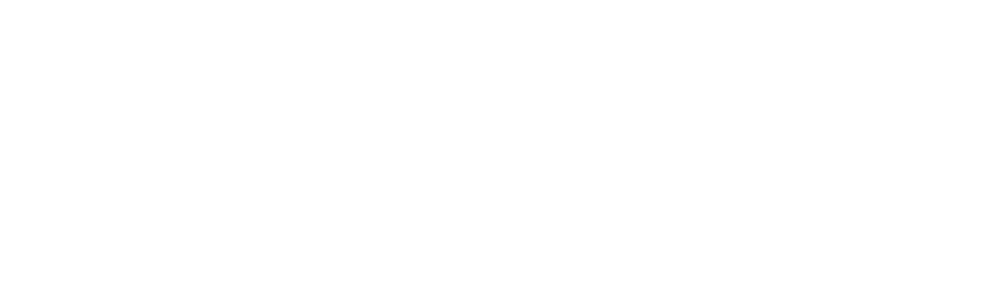

A place to organize your thoughts 💭 in blocks 🧱

This is being built with [Express](https://expressjs.com/) and [EJS](https://ejs.co/#about).
You can view it by downloading the project and hosting it locally with something like [nodemon](https://www.npmjs.com/package/nodemon).

## Update as of 16.09.2024

- added page logos
- finished building and styling partials and the home page

## Functionality to be made ⬇

- Creating posts (thoughts) ❌
- Viewing posts (blocks) ❌
- Adding how important a posts is, so color coding them ❌
- Deleting posts ❌
